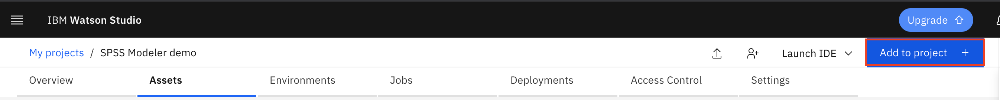
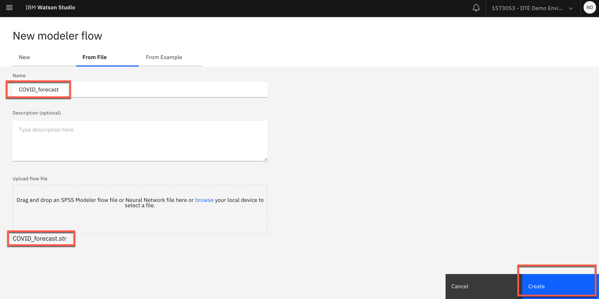
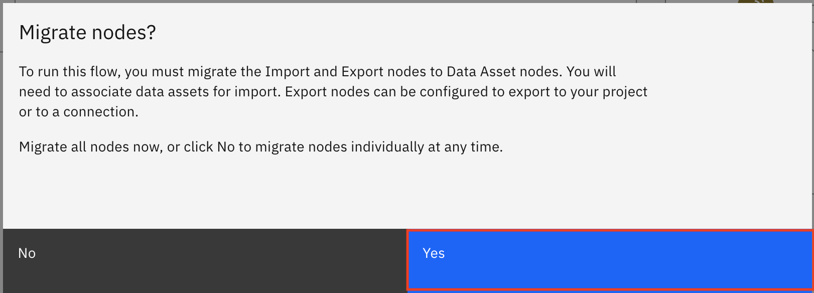
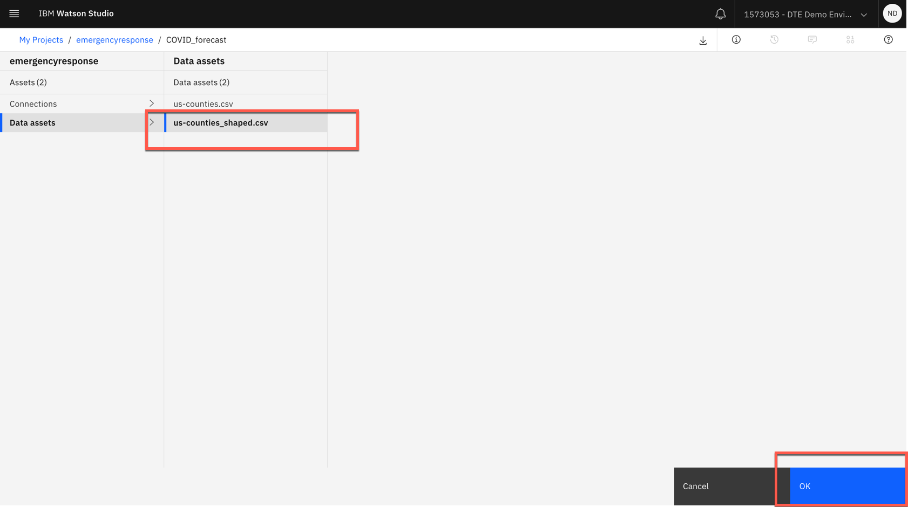
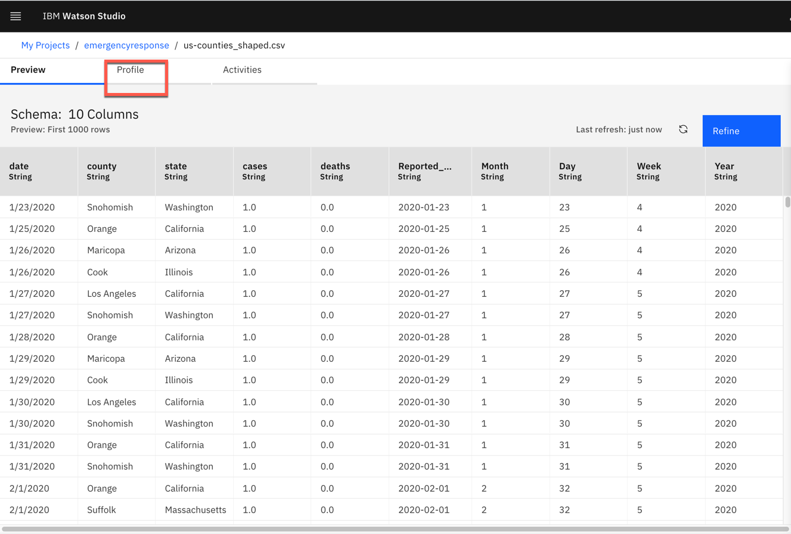
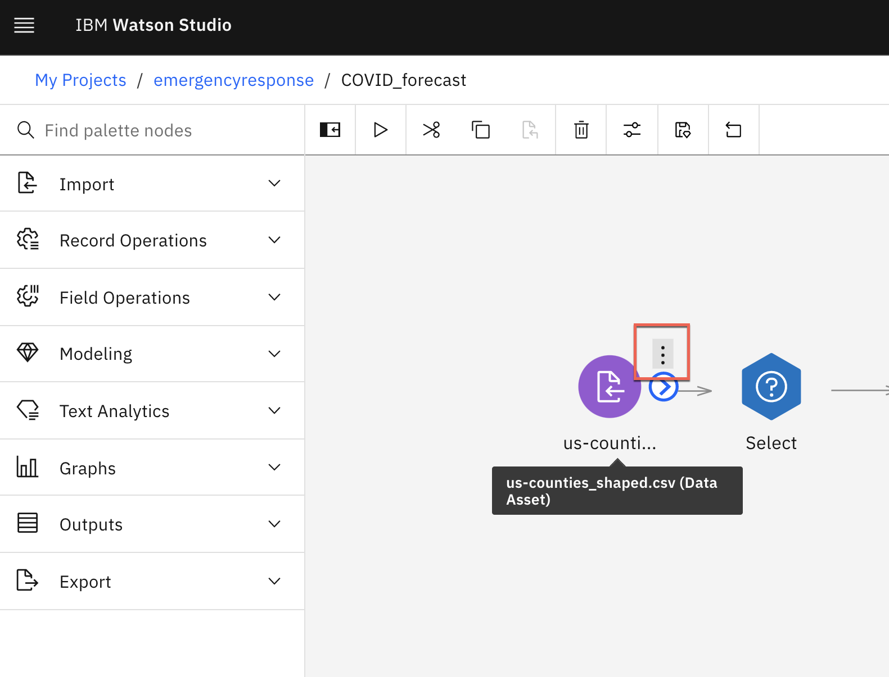
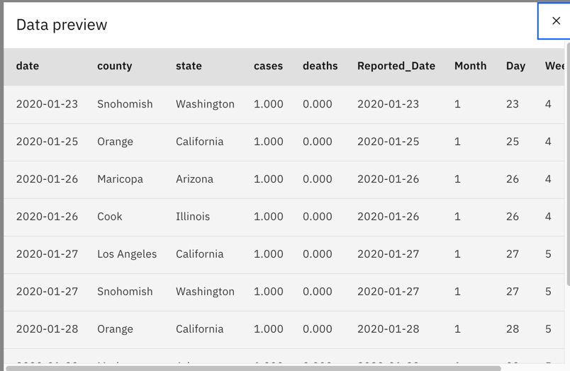
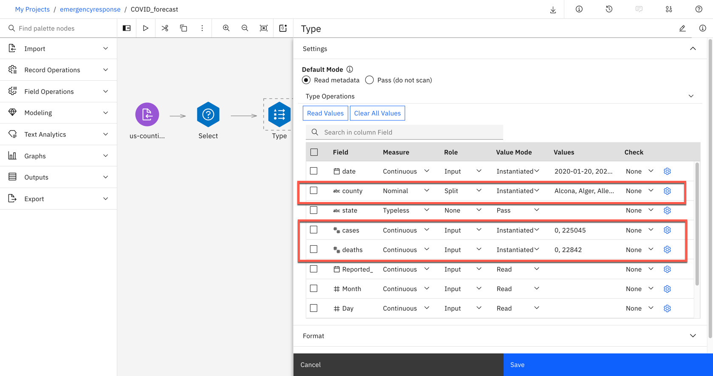
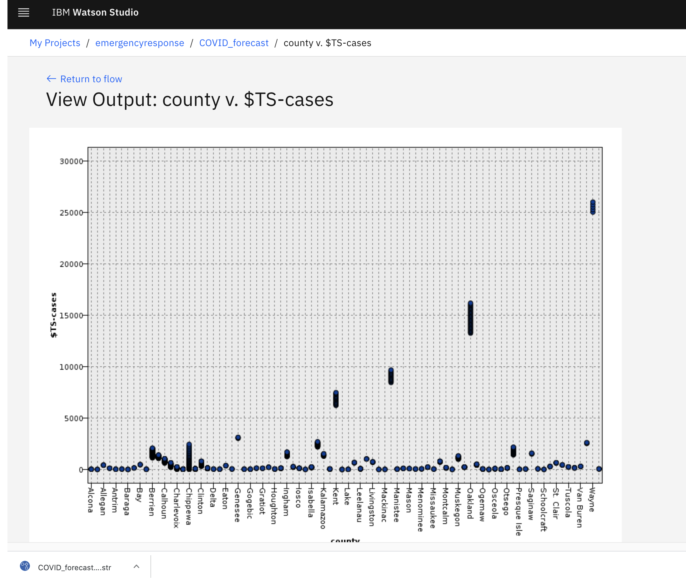

# Use SPSS Modeler to predict PPE equipment based on COVID-19 data for Michigan counties
In this part of the solution, we will work on predicting future demand of PPE products to help us determine inventory level using SPSS Modeler for Watson Studio on IBM Cloud. SPSS Modeler is a data mining and analytics software
that is used to build predictive models. Using SPSS Modeler for Watson Studio enables data scientists and data analysts to work in a collaborative, cloud-based environment and quickly share their models and results with
their stakeholders. 

## Learning objectives
After completing this tutorial, the user will learn: 
* How to create an SPSS Modeler flow
* How to use the SPSS tool to profile and analyze data
* How to modify, filter, and prepare data for AI Model creation
* How to create model with SPSS and evaluate the results

## Estimated Time
Completing this tutorial should take about 30 minutes.

## Step

1. [Add a Modeler Flow to your Watson Studio Project](#3-Add-a-modeler-flow-to-your-watson-studio-project)
2. [Import the data](#4-import-the-data)
3. [Explore the data](#5-explore-the-data)
4. [Data preparation](#6-data-exploration)
5. [Train the ML model](#7-Train-the-ML-model)
6. [Evaluate the results ](#8-Evaluate-the-results)

### 3. Add a Modeler Flow to your Watson Studio Project

* Click on your newly created project.

* Once you have created your Watson Studio Project, you see a blue `Add to Project` button on the top-right corner of your screen. 

* Click on `Add to Project` and then select `Modeler Flow`. 

* Next, select `From File` and `browse` to where you cloned this repository. Select the `Demand Forecast.str` file. Next, click `Create`.

### 4. Import the data

* SPSS Modeler will then ask you to migrate nodes. Click on `Yes`.

* For the import node, click on `Data Assets` and then choose the `TM1 Import.csv` file, which contains our demand data for our retail products. Next, click `OK`.

* For the export node, click on `Target Path` and then choose type out `predictedDemand`. This will be the file name that is created when our model outputs the
predicted demand. This file will be saved to our current project in Watson Studio. Click `Migrate`.

### 5. Explore the data

Before we do any analysis and predictions on the data, it's 
a good idea to explore your data set. 

* From the `Data Import` node, hover over the node and 
click on the three-dot symbol to the right of the node. Next,
click on `Profile`.

* Once the node loads, you will see a preview of the data set.
Click on `Profile` from the top of the screen to see 
some graphs which show the frequency of the values for the
features in your data set. 

* Here you can notice that our data set which describes the 
demand at our retail store is broken up by 
month, in the `Period` column. Also, it provides further 
details on the markets our retail store operates in in the 
`Markets` column. 

* For the purpose of our demo, the most important column is `Actuals`
which is the amount of demand that we have per product. Some of the 
statistics on this show that the median `Actuals` value is 59.5, and 
the maximum being `115`. This is great to know, since we want to ensure
that we can stock up inventory to the max level, so that we know that 
we will not run out of stock. 

* Once you are done exploring the data set, you can return back to the flow
by clicking on the flow name in the top-left breadcrumb.

### 6. Data preparation
Next, we will focus on the data prep nodes. These are the nodes
which will modify our data set to predict just the values we want. A great way to understand what each node is 
doing is to `Preview` the node.

* To preview a node, such as the `TM1 Import` node, hover over the node, and click on the three-dot symbol.

* Next, click on `Preview`.

* This is a quick and easy way to see what the data looks like at the current node in the flow. Below is what you should see 
once you've previewed the node.

* Hover over the `Date` node, click on the `Three-dot` symbol, 
and then on `Preview`.

* Once you preview the node, you should see that the Date node adds another column to the data set, called 
`Date` and derives that value from the `Period` column. 

* The `Filter` node, which comes right after the `Date` node, takes out the `Statistical Base Forecast column`, and leaves the other columns as is.

* Next, the `Select` node is very important. It's going to take a subset of the data, and it will use an expression to do so. You can 
see in the expression, we have only taken the `US` markets, and the `Date` when it is before Jan 2019. This will enable use to make more 
specific predictions, only for the `US` market, since that is where our retail store manager that we want to focus on is located. If you 
preview this node, you will see that the `Markets` column does not feature any value other than `US`.

* The last of the data prep nodes is the `Type` node. This enables us to make specific operations on the fields within our data set. In 
this node, we split the `Products` column into individual values, so that we can later predict demand 
for each of our products within that column.

* Next, the restructure node creates new columns for the dataset. It takes the values from the 
`Products` column, and adds the `Actual` demand value for that product, in a separate column, so that
demand for a specific product is easily distinguishable.

* Hover over the `Restructure` node, click on the `Three-dot` symbol, and then `Preview` to see the
new columns that are added to our data set.

* Also, feel free to `Open` the node as well, which will show you how we generated multiple fields
from merging the `Products` and `Actuals` columns.

* Hover over the `Aggregate` and then click `Open`. 
There, you will see that we are taking the largest
value from the fields such as `Products_mask_Actuals` that we created above. This is because we want  and ensure we have enough in inventory to 
satisfy the maximum demand.

* Similarly, hover over the `Aggregate` node, click on the `Three-dot` symbol, and then `Preview` to see the
new columns with the `_Max` suffix added to them.

* Hover over the `Type` and then click `Open`. 
There, you will see we've designated the new
fields that we created in the previous steps 
as the target variables, since we want to predict 
the max demand for each of the products within 
the `Products` column, within the `US` market.

### 7. Train the ML model

* Hover over the `29 fields` golden nugget and then click `Run`. 
This will run the time-forecasting model with the data we have 
prepared in the previous steps.

* Once the model 
has finished running, you will see the Outputs tab has been
updated.

### 8. Evaluate the results 

* Double-click on `Analysis of [29 fields]` in the Outputs tab.
Here you can see an assessment of the mean error, maximum error
and other values which compare the `$TS-Products_Actuals_Max` i.e. the maximum demand forecasted by the model for a particular product, versus `Products_Actuals_Max` which is the max which has 
been recorded for the training period i.e. 2016-2018.

* Double-click on `Analysis of [10 fields]` in the Outputs tab.
Here you will see a visual representation of a few of the 
interesting products which have shown to have spiked in demand
over the past three months of training data. In October, 
November, and December of 2018, these five particular products,
masks, hand sanitizer, and spray cleaner have all spiked in 
demand, much higher than previously recorded, such that the 
forecasted values for 2019, the year we are predicting, are all
much higher due to these three months of training data. We can see this by the slope of the line increasing drastically in the 
`$TS-Products_Actuals_Max` charts vs. the `Products_Actuals_Max`
charts.

### Summary 

This tutorial demonstrates a small example of creating a predictive machine learning model on IBM SPSS Modeler on Watson Studio and IBM SPSS Modeler software. The tutorial goes over on importing the data into the project and the modeler flow, and preparing the data for modeling. The tutorial then goes over the running a time series algorithm for the data and training a prediction model. The last step of the tutorial is about how to visualize and evaluate the results of the trained model.
